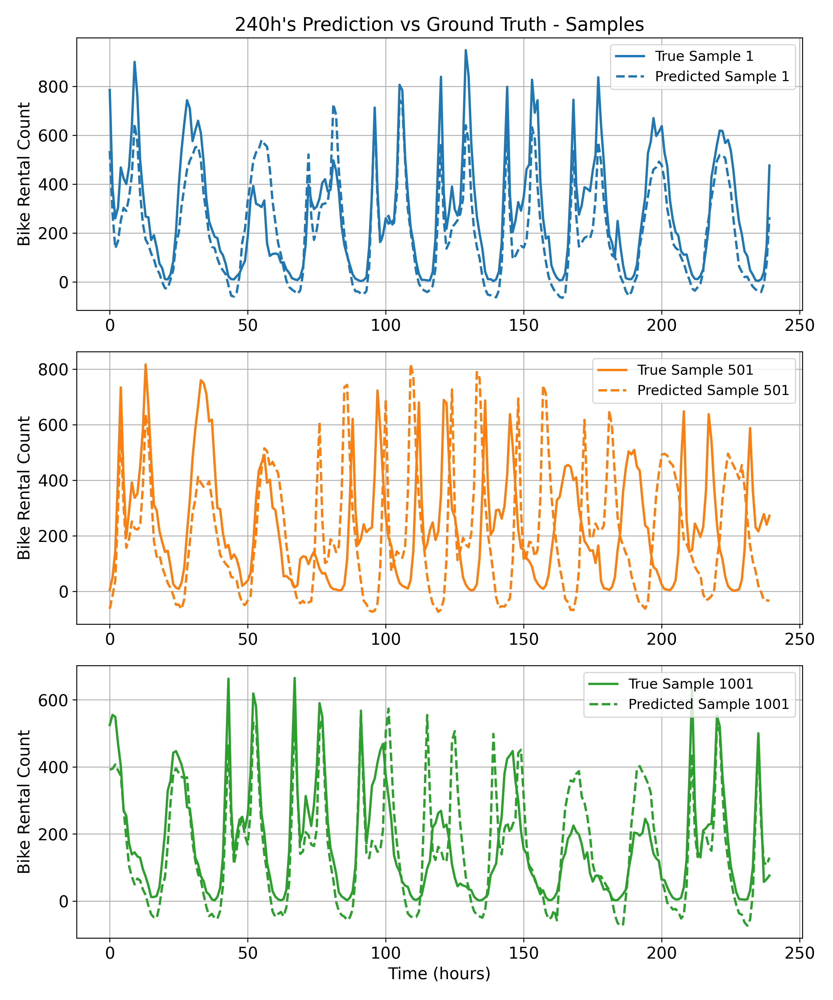
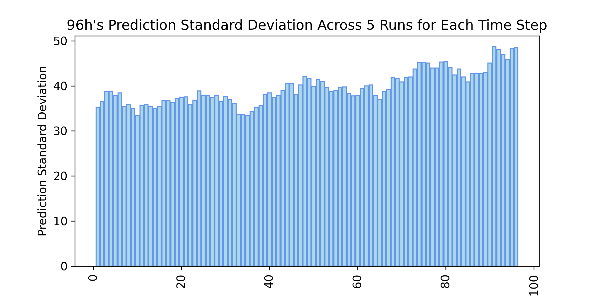
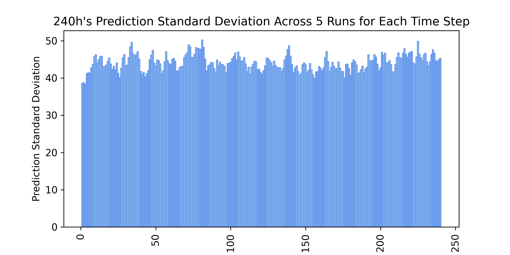

# This is 3Predictions4Bikes.
- There are three folders named LSTM, Transformer, TNN-BEATS, and a data folder. They store three corresponding prediction models and the data used by the models respectively.
- In the **LSTM** folder, lstm.ipynb is the complete code of the model, along with the training dataset train_data.csv and the test dataset test_data.csv.
- In the **Transformer** folder, transformer.ipynb is the complete code of the model, along with the training dataset train_data.csv and the test dataset test_data.csv.
- In the **TNN-BEATS** folder, train_96h.py and train_240h.py are training codes. test_96h.py and test_240h.py are codes for testing and comparing the real - predicted values (including graphing). std_cmp_96h.py and std_cmp_240h.py are codes for comparing the five-round training and standard deviation (including graphing). std_cmp_96h_plot.py and std_cmp_240h_plot.py are graphing codes for standard deviation comparison. train_data.csv is the training data and test_data.csv is the test data.
- The predictions and standard errors of **TNN-BEATS** are shown in pictures as follow:

